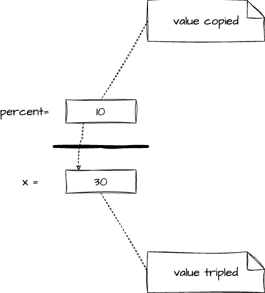
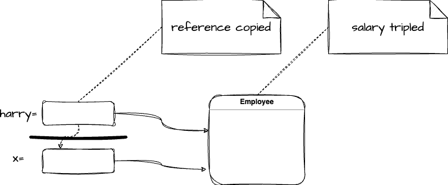
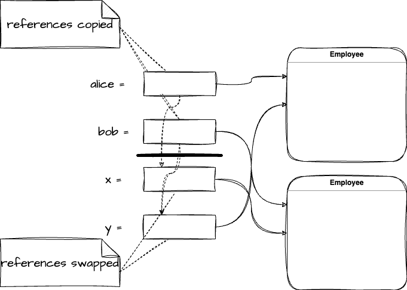

# 理解 Java 中的参数传递机制：值传递还是引用传递？
> 该篇文章，假设你是 Java 新手或对 Java 参数传递机制一知半解的开发者。

## 引言

Java 编程中，经常需要将变量作为参数传递给方法。 但是,这些参数在方法内部的机制往往引发新手和有经验的开发者之间的讨论: Java 的参数传递到底是值传递还是引用传递?

理解 Java 中的参数传递机制能让我们预测和理解代码的行为，更甚影响我们如何设计方法。

如果我们错误地假设 Java 使用引用传递，那么我们可能会期待一个方法会修改其接收到的参数，但事实上它永远不会。 同样，如果我们不理解在处理引用类型时，Java 实际上将引用的值传递给方法，那么我们可能会对方法对对象状态产生的影响感到困惑。

因此，本文将深入探讨 Java 中的参数传递机制，并通过实例来解析这个重要但有时令人困惑的话题。

## 定义

“值传递” 和 “引用传递” 是两种常见的参数传递方式，具体定义如下:

- 值传递(Pass by Value) : ==**在值传递中, 方法接收参数值的一个副本。**== 也就是说，你传递参数给方法时，方法会创建一个新的变量，并复制传递进来的值。因此,在方法中对参数的任何修改都只会影响这个复制到值，而不会影响原来的变量。
- 引用传递(Pass by Reference) : ==**在引用传递中，方法接收的是实际参数的引用，而不是值的副本。**== 也就是说，你传递的是指向实际参数的指针。因此，在函数中对参数的任何修改都会影响原来的变量。

==**Java 中，无论是基本类型还是引用类型，都是采用值传递的方式。** ==具体如下:

- 对应基本类型(如 int, float,boolean 等)，Java 会将这些类的值复制一份，然后将复制的值传递给方法。在方法中对这些基本类型值的任何修改都不会影响原始变量。
- 对应引用类型(如数组和对象)，Java 会将引用(理解为指向内存中某个对象的指针)复制一份，然后将复制的引用传递给方法。在方法中，可以通过该复制的引用来访问和修改原始对象的状态。但是，如何在方法中尝试改变引用本身(即尝试将它指向另一个对象)，这个改变不会影响原来引用。

这就是Java处理值传递和引用传递的方式。虽然在处理对象时，Java传递的是对象引用的值，但这并不等同于传统意义上的引用传递。

>补充 : 在传统意义上的引用传递中，函数接收的是实际参数的引用，而不是参数值的副本。这意味着函数接收到的是指向实际参数的指针或引用，而不是参数值的一个副本。这种情况下，函数可以直接修改传入的参数值。
>换句话说，引用传递允许被调用的函数或方法修改传入参数的值，包括改变引用参数所指向的对象或内存地址。这是因为引用传递的参数是对实际参数的直接引用，而非创建新的变量。
>例如，在一些支持引用传递的语言（如C++）中，你可以编写一个函数，该函数接收一个对象的引用，并在函数内部更改这个引用，使其指向另一个对象。当这个函数返回时，原始的引用也将指向这个新对象。这种情况在Java中是无法发生的，因为Java传递的是引用的值（也就是地址值），而不是引用本身。

## 常见误解&经典示例

一个常见的误解是 Java 中的对象是通过引用传递的.。这可能源于对 “值传递” 和 “引用传递” 概念的误解, 以及 Java 中如何处理对象(引用类型)的不理解。

==**如前所述，Java 中的所有参数传递都是通过值传递的。**== 这包括基本类型和引用类型。当我们说对象或引用类型是通过值传递的，我们指的是对象的引用(实际上是指向内存地址的值)被复制,并将复制后的引用值传递给方法。

如果 Java 真的采用引用传递，那么你可以在一个方法中改变引用本身指向的对象。然而在 Java 中，你不能改变方法接收的引用指向的对象。你只能改变通过这个引用访问到的对象的状态。以下是一个经典代码示例:

```java
public class ParamTest {  
	public static void main(String[] args) {  
		/**  
		* 测试一:方法无法修改数值参数  
		*/  
		System.out.println("Testing tripleValue:");  
		double percent = 10;  
		System.out.println("Before: percent=" + percent);  
		tripleValue(percent);  
		System.out.println("After: percent=" + percent);  
		/**  
		* 测试二:方法可以更改对象参数的状态  
		*/  
		System.out.println("\nTesting tripleSalary:");  
		Employee harry = new Employee("Harry", 50000);  
		System.out.println("Before: salary=" + harry.getSalary());  
		tripleSalary(harry);  
		System.out.println("After: salary=" + harry.getSalary());  
		/**  
		* 测试三:方法无法将对象参数指向另一个对象  
		*/  
		System.out.println("\nTesting swap:");  
		Employee alice = new Employee("Alice", 70000);  
		Employee bob = new Employee("Bob", 60000);  
		System.out.println("Before: alice=" + alice.getName());  
		System.out.println("Before: bob=" + bob.getName());  
		swap(alice, bob);  
		System.out.println("After: alice=" + alice.getName());  
		System.out.println("After: bob=" + bob.getName());  
	}  
	  
	public static void tripleValue(double x) {  
		x = 3 * x;  
		System.out.println("End of method: x=" + x);  
	}  
	  
	public static void tripleSalary(Employee x) {  
		x.raiseSalary(200);  
		System.out.println("End of method: salary=" + x.getSalary());  
	}  
	  
	public static void swap(Employee x, Employee y) {  
		Employee temp = x;  
		x = y;  
		y = temp;  
		System.out.println("End of method: x=" + x.getName());  
		System.out.println("End of method: y=" + y.getName());  
	}  
}  
  
class Employee {  
	private String name;  
	private double salary;  
  
public Employee(String name, double salary) {  
	this.name = name;  
	this.salary = salary;  
}  
  
public String getName() {  
	return name;  
}  
  
public double getSalary() {  
	return salary;  
}  
  
public void raiseSalary(double byPercent) {  
	double raise = salary * byPercent / 100;  
	salary += raise;  
}  
}
```

附上测试一、测试二和测试三的图


]

测试结果

```txt
Testing tripleValue:
Before: percent=10.0
End of method: x=30.0
After: percent=10.0

Testing tripleSalary:
Before: salary=50000.0
End of method: salary=150000.0
After: salary=150000.0

Testing swap:
Before: alice=Alice
Before: bob=Bob
End of method: x=Bob
End of method: y=Alice
After: alice=Alice
After: bob=Bob
```

==**结果输出证明了 Java 中对象是通过值传递的，即传递的是引用的值,而不是引用本身。**==

## 结论

Java 中的参数传递机制是值传递。

在Java中，方法调用时，基本类型参数的值会被复制，修改这个复制的值不会影响原始变量。对于引用类型，复制的是引用，虽然不能改变引用本身，但可以通过它修改对象状态。这是理解Java参数传递的关键。

## 参考链接:

[《Java 核心技术》第四章 : 对象和类(上),节选4.5 理解 Java 中的参数传递.](https://www.bilibili.com/video/BV1SS4y1g7SK/?spm_id_from=333.999.0.0&vd_source=57aa19cc5537499cb225118806e93e4b)
[Horstmann Blog](https://horstmann.com/corejava/)
